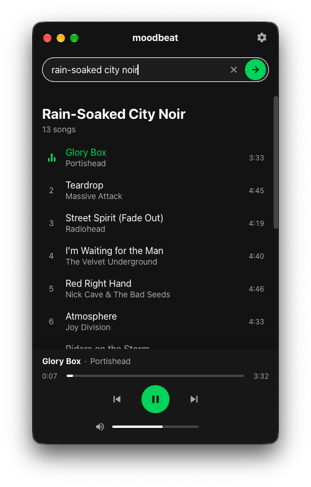

<p align="center">
  
</p>

<h1 align="center">moodbeat</h1>

<p align="center">
  music player creating custom playlist depending on your vibe
</p>

<p align="center">
  Type a mood (<em>"90s rock"</em>, <em>"rainy day in New York"</em>, <em>"Polish summertime"</em>),
  and moodbeat asks OpenAI for 10–15 matching songs, finds them on YouTube, downloads them as MP3
  and plays them in order.
</p>

<p align="center">
  <a href="https://github.com/pwittchen/moodbeat/actions/workflows/ci.yml"></a>
</p>

<p align="center">
  <a href="./SPEC.md">Specification</a> · <a href="./DESIGN.md">Design system</a>
</p>

<p align="center">
  
</p>

---

## Requirements

- Rust (stable) and Node.js 20+
- Tauri 2 system dependencies: <https://v2.tauri.app/start/prerequisites/>
  (on Linux also GStreamer plugins for MP3 playback, e.g. `gstreamer1.0-plugins-good`)
- An OpenAI API key (entered in Settings, or `OPENAI_API_KEY` in the environment)
- `yt-dlp` and `ffmpeg` — found on `PATH`, or installed automatically into `~/.moodbeat/bin/`

## Development

```sh
npm install
npm run tauri dev      # run the app
npm run tauri build    # build a release bundle
npm run kill           # stop a running dev session (Vite + app)
```

Tests:

```sh
npm test                                   # frontend (player queue logic)
cd core && cargo test                       # backend unit tests
MOODBEAT_INTEGRATION=1 cargo test -- --ignored   # real YouTube search + download
```

All app data (settings, audio cache, playlists, logs) lives in `~/.moodbeat/`.

To change the app icon, replace `logo.png` (a rounded-square icon on a white background) and run:

```sh
python3 scripts/make-icon.py && npx tauri icon core/icons/app-icon.png -o core/icons
rm -rf core/icons/android core/icons/ios && touch core/build.rs
```

## Legal note

Downloading from YouTube may conflict with YouTube's Terms of Service and with copyright law
in some countries. moodbeat is meant for personal use only and intentionally provides no way to
export or share downloaded files.
